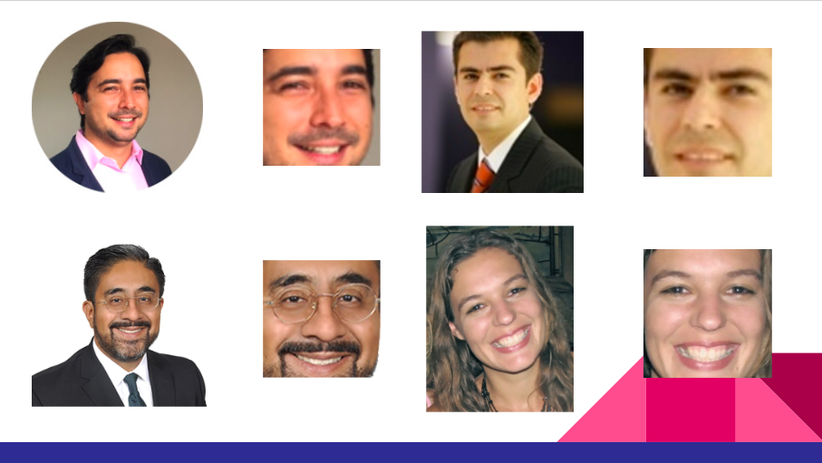
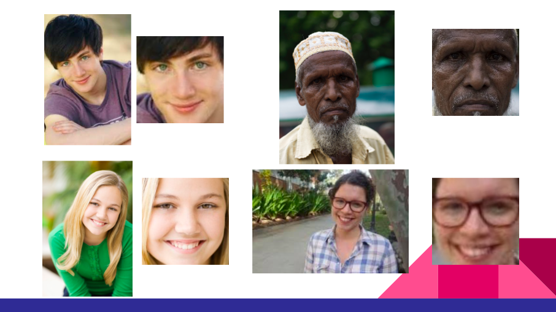

# Face Alignment Module

This is a multipataform C++ project that align a face of an input image, identifying the eyes region to obtain a normalized and rotated representation of the face.

## Description

This is the 2nd module of a **Face Recognition** project. Functional and non-functional requirements can be found on the following link: [link to Trello!](https://trello.com/invite/b/5WHeFcX2/cf90313ec5cdf6685094467676a64ffd/face-recognition-module-2)

## Visuals
* Here are some examples of images aligned with the project. We can observe that all images are different and all images are aligned and cropped.

## Requirements
* Linux, Windows or macOS
* OpenCV
* Dlib

## Installation
The project includes a 'Main2' file which already has the instance of the class and a 'Input' folder with sample images. You can change the main to your convenience.
Steps to follow for the installation:
* Step 1 --> Download the project.
* Step 2 --> Extract de project.
* Step 3 --> On the 'CMakeLists.txt' file change the following:
* add_subdirectory(/Users/brias5/desktop/face_alignment/dlib-19.17 dlib_build) <-- Insert your path to dlib in here.
* Step 4 --> When making an instance of 'FaceAligner2' in 'Main2' you can provide the path to the 'shape_predictor_5_face_landmarks', if you don't the constructor will automatically pull it from the Folder you already downloaded. Here you can change the parameters given to the ones that you need in order to have the face in a specific position or with a specific size.
* Step 5 --> On the 'Input' folder add the images you want to align, each one labeled in an ascendant order starting with 1. You can find a 100 images to test the project on the file.
* Step 6 --> Compile on the terminal using the command 'make' and then run the executable. On the 'Output' folder you will find the aligned images. You can also observe on the terminal the size of each image, the points were the eyes are in the new image and the time taken by the function to align the image.

## Tests
On the requirements of the project it is required to have a 99% precision and that the function worked under a 300 ms range of time.
When running the project you can observe on the terminal the average time taken by all images, the minimum and maximum time the images took to align and the precision after aligning all.
This tests where done with help of the 'chrono' functions. When the new image is aligned on a different pixel from the chosen one the precision will decrease, on the tests it is accepted a 2 pixels difference.

## Usage
In order to create a FaceAligner, you have to pass it the coordinates where you want the eyes to be in after the alignment, the desired dimension of the output aligned image, and, if you want to, you can also pass the path to the shape_predictor, if not omit the parameter.
* FaceAligner2::FaceAligner2(double xDesiredLeftEye1, double yDesiredLeftEye1, double xDesiredRightEye1, double yDesiredRightEye1, int desiredFaceWidth1, int desiredFaceHeight1, std::string path)
* Example: FaceAligner2 faceA2(40.0, 50.0, 110.0,  50.0, 150, 150, "/Users/brias5/Desktop/face_alignment/build/shape_predictor_5_face_landmarks.dat");

In order to align an image use the following commands on the main file:
* cv::Mat imageMat;
* detector = get_frontal_face_detector();
* imageMat = cv::imread("Input/" + to_string(i) + ".jpg"); <-- transform the image to a mat.
* load_image(img, "Input/" + to_string(i) + ".jpg"); <-- loads image.
* dets = detector(img); <-- detects face.
* alignedImage2 = faceA2.alignCV(imageMat, dets[0]); <-- calls the function alignCV.
* cv::imwrite("Output/faceAligned" + to_string(i) + ".jpg", alignedImage2); <-- creates the image file of the aligned image.

## Design of the class FaceAligner2
------------
FaceAligner

    shape_predictor sp;
    +double DesiredLeftEye[2];
    +double DesiredRightEye[2];
    +int desiredFaceWidth;
    +int desiredFaceHeight;

------------
    -align(array2d<rgb_pixel> &img, std::vector<rectangle> dets)
    -alignCV(cv::Mat imageMat, std::vector<rectangle> dets)

## ¿How does the function alignCV work?

* First it determines the position of the center of the eyes from the original image.

* Then it the scale is calculated through the eyes positions from the input and the output images.

* It is calculated the angle between the eyes to know how much to rotate.

* It is calculated the translation from the original image to the output image.

* It is calculated the rotation matrix with the angle, translation and scale. This returns a mat.

* It is calculated the output image mat with the function 'warpAffine' using the original mat, the rotation matrix mat and the desired size.

* Finally it returns the output mat.

## Authors and acknowledgment
Author | Role
------------ | -------------
Cristopher Cejudo | Project Developer
Martin Alegría | Project Developer
Ruben Sánchez | Project Developer
Sabrina Santana| Project Developer
Octavio Garduza | Project Developer
Raziel Martínez | Project Developer

* Leonardo Chang. Role: Project Manager

## Project status
⚠️ Under Maintenance ⚠️
